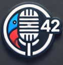

# Babel Fish AI - AIを使用した音声文字起こしおよび翻訳拡張機能

**拡張機能を使用するには、OpenAIのAPIキー（またはLiteLLM Proxyを使用している場合はサードパーティのプロバイダーキー）が必要です。OpenAIのAPIキーはここで生成できます : [https://platform.openai.com/account/api-keys](https://platform.openai.com/account/api-keys)**

Babel Fish AIは、元々強力な音声文字起こしを提供するために設計された革新的なChrome拡張機能です。OpenAIのWhisper APIを使用して、驚くほどの精度であなたの音声をテキストに変換し、オプションでリアルタイムの自動翻訳も利用できます。Babel Fish AIは、文字起こし専用に使用することも、必要に応じて即時翻訳を有効にすることも可能です。

 

## 🌟 機能

- **高度な音声文字起こし**
  - デバイスのマイクを使用して高品質なオーディオをキャプチャ。
  - OpenAIのWhisper APIによる正確な文字起こし。
  - 複数言語に対応した音声認識およびテキスト表示により、さまざまな言語の音声入力を文字起こしし、（文字起こしおよび翻訳が有効な場合）選択した言語で結果を表示。
  - アクティブな入力フィールドにテキストを自動挿入するか、専用のダイアログボックスに表示。

- **インテリジェントな翻訳と言い換え**
  - 必要に応じて有効にできる、さまざまな言語への即時翻訳。
  - テキストのスタイルと明瞭さを向上させるための言い換え。
  - 元の意味を忠実に再現するために、高度なAIモデルを使用。
  - 文字起こしのみの使用か、文字起こしと翻訳の組み合わせかを自由に選択可能。

- **強力なコンテキストメニュー**
  - 選択したテキストを即座に改善する「選択範囲の言い換え」オプション。
  - 利用可能な全言語のサブメニュー付き「選択範囲の翻訳」オプション。
  - 選択したテキストを、翻訳または言い換えたバージョンに直接置換。
  - Chromeのネイティブなユーザーインターフェースに完璧に統合。

- **直感的でカスタマイズ可能なユーザーインターフェース**
  - 柔軟な表示モード：アクティブな入力エリアまたはフローティングダイアログウィンドウ。
  - 色、透過度、表示時間を選択可能なステータスバナー。
  - 録音開始/停止のためのキーボードショートカット（Ctrl+Shift+1 または Macでは⌘+Shift+1）。
  - 結果の表示時間を制御するための「固定表示」オプション。
  - マイクロフォンと数字「42」を組み合わせたカスタムアイコンによる即時認識。

- **高度なオプション**
    - 詳細な構成（APIのURL、ドメインごとの設定など）のためのエキスパートモード。
    - 文字起こしおよび翻訳のモデルをカスタマイズする機能。
    - LiteLLM Proxyとの互換性により、代替の言語モデルに接続して、リクエストのログ記録を無効化可能。
    - 複数の言語でのインターフェースと音声サポートを提供する言語ファイル（_locales）による国際化の完全管理。

## 🌐 対応言語

以下はBabel Fish AIが対応する言語のリストで、デモ動画へのリンクもあります：

- [アラビア語](https://www.youtube.com/watch?v=onzOGx7nbUE)
- [ドイツ語](https://www.youtube.com/watch?v=G1QVF1NTQYE)
- [英語](https://www.youtube.com/watch?v=QC8WiIszn3Q)
- [スペイン語](https://www.youtube.com/watch?v=nA93pis4vDQ)
- [フランス語](https://www.youtube.com/watch?v=ITNFjx7Mgo4)
- [ヒンディー語](https://www.youtube.com/watch?v=FMEYdwCqoPg)
- [イタリア語](https://www.youtube.com/watch?v=QgYZt8myods)
- [日本語](https://www.youtube.com/watch?v=noHEJCnocH8)
- [韓国語](https://www.youtube.com/watch?v=YrYN75YSH3w)
- [オランダ語](https://www.youtube.com/watch?v=OnAZHzbd2NQ)
- [ポーランド語](https://www.youtube.com/watch?v=E5AVNjZYOxM)
- [ポルトガル語](https://www.youtube.com/watch?v=st0XwCV1tvo)
- [ルーマニア語](https://www.youtube.com/watch?v=H2IMpU5_Hew)
- [スウェーデン語](https://www.youtube.com/watch?v=HMMzGyW8000)
- [中国語](https://www.youtube.com/watch?v=OJe6oVA_Y0s)

## 🚀 インストール

1.  **ダウンロードとインストール :**
    - GitHubからこのリポジトリをクローンするか、拡張機能のフォルダを手動でダウンロードしてください。
    - **または[Chromeウェブストア](https://chromewebstore.google.com/detail/babelfishai-by-jls42org/aahodplbenfmijbeahnhoklpdnmfdmbk)から直接拡張機能をインストール。**
    - Chromeを開いて、`chrome://extensions/`にアクセス。
    - 右上で「デベロッパーモード」を有効にする。
    - 「パッケージ化されていない拡張機能を読み込む」をクリックし、Babel Fish AIのフォルダを選択。

2.  **確認 :**
    - Chromeのツールバーにカスタムアイコン付きの拡張機能が表示されていることを確認。

## ⚙️ 設定

1.  **OpenAI APIキー :**
    *   拡張機能のアイコンをクリックしてオプションにアクセス。
    *   OpenAIのAPIキーを入力（[platform.openai.com/account/api-keys](https://platform.openai.com/account/api-keys)で入手可能）。

2.  **オプションのカスタマイズ :**
    *   表示モード（アクティブな入力エリアまたはダイアログボックス）を選択。
    *   ステータスバナーの色、透過度、表示時間を設定。
    *   文字起こし用（音声入力）とテキスト表示用の言語を選択。
    *   必要に応じて翻訳機能を有効または無効にする。

3.  **（オプション）LiteLLM Proxyとの使用 :**
    *   オプションで「エキスパートモード」を有効にする。
    *   「高度な設定」のセクションで、LiteLLM Proxyのインスタンスを指すようにAPI（Whisperと翻訳）の**両方のURL**を変更。**両方に同じベースURLを使用してください。**
    *   LiteLLMによるリクエストのログ記録を無効にしたい場合は、「NoLog (LiteLLMのみ)」オプションにチェックを入れる。

## 🚀 LiteLLM Proxyとの使用

OpenAI以外の言語モデルを使用したい場合は、LiteLLM Proxyを利用できます。以下はその構成手順です：

Babel Fish AIは[LiteLLM Proxy](https://litellm.ai/)と互換性があり、OpenAIと互換性のあるAPIを使用して代替の言語モデルを利用することができます。

### 設定

1.  **LiteLLM Proxyのインストールと設定 :** LiteLLMのサイトの指示に従ってください。
2.  **Babel Fish AI拡張機能の設定 :**
    *   拡張機能のオプション（アイコンを右クリック > オプション）で「エキスパートモード」を有効にする。
    *   「高度な設定」のセクションで、LiteLLM Proxyのインスタンスを指すようにAPI（Whisperと翻訳）の**両方のURL**を変更（例: `http://localhost:4000/v1/audio/transcriptions` および `http://localhost:4000/v1/chat/completions`）。**両方に同じベースURLを使用してください。**
    *   LiteLLMによるリクエストのログ記録を無効にしたい場合は、「NoLog (LiteLLMのみ)」オプションにチェックを入れる。

**重要 :** 「NoLog」オプションはLiteLLM Proxy専用に設計されています。公式のOpenAI APIを使用している場合は**有効にしないでください**。そうしないとエラーが発生し、翻訳が機能しなくなります。

## 🛠️ 技術的な動作

### 拡張機能のアーキテクチャ

拡張機能は、相互に連携する複数のJavaScriptファイルで構成されています。

#### 主なファイル

*   **`manifest.json` :** 拡張機能の主要な設定ファイル。権限、スクリプト、アクセス可能なリソースなどを定義しています。Manifest Version 3を使用し、`activeTab`、`storage`、`commands`、`scripting`、および`contextMenus`の権限を宣言しています。
*   **`background.js` :** バックグラウンドで実行されるサービスワーカー。イベント（アイコンのクリック、キーボードショートカット、コンテキストメニュー）を管理し、必要に応じて`content script`を注入し、`content script`と通信します。
*   **`content.js` :** ウェブページに注入されるメインスクリプト。各種ユーティリティモジュールを調整し、拡張機能全体のフローを管理します。
*   **`src/constants.js` :** 設定、状態、アクションなどの定数を定義。

#### ユーティリティモジュール

拡張機能は、専門化された複数のユーティリティファイルを持つモジュラーアーキテクチャを採用しています。

##### API管理とデータ処理

*   **`src/utils/api.js` :** APIとの連携、特にOpenAIのWhisper APIを呼び出すための`transcribeAudio`関数を含みます。
*   **`src/utils/api-utils.js` :** 外部APIとの連携のための高度な関数。
*   **`src/utils/translation.js` :** OpenAIのGPT APIを呼び出すための`translateText`および`rephraseText`関数を含みます。
*   **`src/utils/text-translation.js` :** テキストの翻訳と言い換えに特化した関数。
*   **`src/utils/text-processing.js` :** 一般的なテキスト処理の関数。

##### ユーザーインターフェースおよびインタラクション

*   **`src/utils/ui.js` :** ユーザーインターフェースのための一般的なユーティリティ関数。
*   **`src/utils/banner-utils.js` :** ステータスバナー、そのコントロール、言語セレクターの管理。
*   **`src/utils/focus-utils.js` :** フォーカスやテキスト選択の保存と復元を管理。
*   **`src/utils/transcription-display.js` :** 文字起こし結果の表示を管理。
*   **`src/utils/error-utils.js` :** エラーの表示と処理を管理。
*   **`src/styles/content.css` :** ウェブページに注入されるユーザーインターフェース用のCSSスタイル。

##### 録音とイベント

*   **`src/utils/recording-utils.js` :** マイクを通じたオーディオの録音とデータ処理を管理。
*   **`src/utils/event-handlers.js` :** ユーザーインタラクション用のイベントハンドラーを含みます。

##### 国際化と言語

*   **`src/utils/languages.js` :** 拡張機能が対応する言語を定義。
*   **`src/utils/languages-shared.js` :** ウェブページコンテキスト向けの対応言語リストを定義。
*   **`src/utils/languages-data.js` :** サービスワーカー向けの対応言語リストを定義。
*   **`src/utils/i18n.js` :** ユーザーインターフェースの国際化を管理。

##### オプションページ

*   **`src/pages/options/` :** 拡張機能のオプションページ用のHTML、CSS、JavaScriptファイルを含む。

### 文字起こしと翻訳のプロセス

#### 音声文字起こしの主要機能

1.  **録音の開始 :** ユーザーは拡張機能のアイコンをクリックするか、キーボードショートカット（Ctrl+Shift+1 または Macでは⌘+Shift+1）を使用して録音を開始します。`background script`が`content script`に録音開始のメッセージを送信します。
2.  **オーディオのキャプチャ :** `content script`は`navigator.mediaDevices.getUserMedia` APIを使用してマイクにアクセスし、MediaRecorder APIを用いてオーディオを録音します。
3.  **文字起こし :** `content script`は`src/utils/api.js`内の`transcribeAudio`関数を使用してオーディオをOpenAIのWhisper APIに送信します。APIは文字起こしされたテキストを返します。
4.  **翻訳または言い換え（オプション） :**
   - 翻訳オプションが有効な場合、`content script`は`src/utils/translation.js`内の`translateText`関数を使用して文字起こしテキストをOpenAIのGPT APIに送信します。
   - 言い換えオプションが有効な場合、`rephraseText`関数を使用して文字起こしテキストを改善します。
5.  **表示 :** `content script`は、処理されたテキストをページ上のアクティブな要素（テキストフィールドや編集可能な要素）またはカスタムダイアログボックスに表示します。

#### コンテキストメニューの機能

1. **テキストの選択 :** ユーザーはウェブページ上でテキストを選択します。
2. **コンテキストメニュー :** 右クリックすると、「選択範囲の言い換え」または「選択範囲の翻訳」オプションと利用可能な言語のサブメニューが表示されます。
3. **処理 :** 選択されたオプションに応じて：
   - テキストは`rephraseText`関数により言い換えのために送信され、
   - テキストは選択されたターゲット言語で`translateText`関数により翻訳のために送信されます。
4. **表示 :** 結果は、元の選択テキストが含まれる要素内で置換されます。

### 通信

`background script`と`content script`間の通信は、ChromeのメッセージングAPI（`chrome.runtime.sendMessage`および`chrome.runtime.onMessage`）を介して行われます。

### データの保存

拡張機能は`chrome.storage.sync`を使用して、以下を保存します：

*   OpenAI APIキー（`apiKey`）。
*   拡張機能のオプション（表示設定、翻訳、バナーの色など）。
*   翻訳用の言語の設定。

これらのデータはChromeの拡張機能ストレージ内にローカルで保存されます。

### エラー管理

不足しているAPIキー、文字起こしエラーなどの可能性のあるエラーは、`constants.js`ファイルで定義されています。`api.js`と`translation.js`内の関数は、API呼び出し時の潜在的なエラーを処理します。`content.js`は、ページ上部のバナーを通してユーザーにエラーメッセージを表示します。

## 🛡️ セキュリティとプライバシー

- **データ保護 :**
  - APIキーはChrome内で安全に保存されます。
  - 拡張機能は音声データを保持せず、すべての処理はリアルタイムで行われます。
  - APIとの通信はHTTPSによる安全な接続を通じて行われます。

BabelFishAIがどのようにあなたのデータを管理するかについての詳細は、当社の[プライバシーポリシー](PRIVACY.md)をご参照ください。

## 🔧 トラブルシューティング

- **マイクの問題 :**
  - Chromeでのマイクアクセスの権限を確認してください。
  - 他のアプリケーションが同時にマイクを使用していないことを確認してください。

- **文字起こし／翻訳のエラー :**
  - APIキーが有効でアクティブであることを確認してください。
  - 安定したインターネット接続があることを確認してください。
  - エラー発生時はChromeのコンソールで詳細なログを確認してください。

## 🤝 貢献

貢献や提案は大歓迎です。貢献するには：
- GitHubのIssuesセクションでバグを報告してください。
- 改善点や新機能の提案を行ってください。
- Pull Requestを送信してください。

## 📄 ライセンス

本拡張機能はGNU Affero General Public License v3.0 (AGPL-3.0)の下で配布されています。詳細についてはLICENSEファイルをご参照ください。

## 💝 支援

この拡張機能を気に入っていただけたなら、[PayPal](https://paypal.me/jls)を通じてサポートしていただけると幸いです.
---
jls42.orgが情熱と革新をもって開発したBabel Fish AIは、最先端の人工知能によって文字起こしと翻訳を新たな次元へと推進します.

**このドキュメントは、fr バージョンから ja 言語へ o3-mini モデルを使用して翻訳されました。翻訳プロセスの詳細については、https://gitlab.com/jls42/ai-powered-markdown-translator をご覧ください。**

