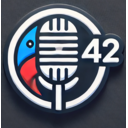

# Babel Fish AI - AIによる音声転写と翻訳の拡張機能

**公式サイト: [babelfishai.jls42.org](https://babelfishai.jls42.org/)**

**拡張機能を使用するには、サポートされているプロバイダーのいずれかのAPIキーが必要です：**

| プロバイダー | APIキーを取得 |
|:------------:|:--------------|
|  | **Mistral AI**: [console.mistral.ai/api-keys](https://console.mistral.ai/api-keys) |
|  | **OpenAI**: [platform.openai.com/account/api-keys](https://platform.openai.com/account/api-keys) |
| 🚅 | **Custom/LiteLLM**: 独自のAPIエンドポイントを使用する場合 |

Babel Fish AIは、マルチプロバイダーサポートを備えた強力な音声転写を提供するために設計された革新的なChrome拡張機能です。Mistral AI (Voxtral) または OpenAI (Whisper) の転写APIを使用して、驚くべき精度で音声をテキストに変換し、オプションでリアルタイムの自動翻訳を利用できます。必要に応じて、Babel Fish AIを転写専用に使用することも、即座に翻訳を有効にすることもできます。

 

      

## 🌟 機能

- **高度な音声転写**
  - デバイスのマイクを介した高品質なオーディオキャプチャ。
  - Voxtral (Mistral AI) または Whisper (OpenAI) APIを介した正確な転写。
  - マルチプロバイダーサポート：Mistral AI、OpenAI、またはカスタムエンドポイントを自由に選択できます。
  - 音声認識とテキスト表示の多言語サポートにより、さまざまな言語で音声入力を転写し、選択した言語で結果（転写と翻訳（有効な場合））を表示できます。
  - アクティブなフィールドへのテキストの自動挿入、または専用のダイアログボックスへの表示。

- **インテリジェントな翻訳とリフレーズ**
  - 必要に応じて有効にできる、さまざまな言語への転写の即時翻訳。
  - スタイルと明確さを向上させるためのテキストのリフレーズ。
  - 元の意味に忠実な翻訳を保証するための高度なAIモデルの使用。
  - 転写のみを使用するか、転写と翻訳を組み合わせるかを自由に選択できます。

- **強力なコンテキストメニュー**
  - 選択したテキストを即座に改善する「選択範囲をリフレーズ」オプション。
  - 利用可能なすべての言語のサブメニューを備えた「選択範囲を翻訳」オプション。
  - スペル、文法、句読点のエラーを修正する「スペルを修正」オプション。
  - 選択したテキストを、翻訳、リフレーズ、または修正されたバージョンに直接置き換えます。
  - Chromeのネイティブユーザーインターフェースへのシームレスな統合。

- **直感的でカスタマイズ可能なユーザーインターフェース**
  - 柔軟な表示モード：アクティブな入力エリアまたはフローティングダイアログウィンドウ。
  - 色、不透明度、表示期間を選択できる構成可能なステータスバナー。
  - 録音を開始/停止するためのキーボードショートカット（Ctrl+Shift+1、Macの場合は⌘+Shift+1）。
  - 結果の表示期間を制御する「開いたままにする」オプション。
  - 即座に認識できるようにマイクと数字「42」を統合したカスタムアイコン。

- **高度なオプション**
    - マルチプロバイダーサポート：最大の柔軟性のためのMistral AI、OpenAI、およびCustom/LiteLLM。
    - プロバイダーごとに転写および翻訳モデルをカスタマイズする機能。
    - 転写と翻訳/リフレーズのためのプロバイダーの独立した選択。
    - 代替モデルに接続するためのCustomプロバイダーを介したLiteLLM Proxyとの互換性。
    - 言語ファイル（_locales）による完全な国際化管理、複数の言語でのインターフェースと音声サポートの提供。

## 🌐 サポートされている言語

Babel Fish AIがサポートしている言語のリストと、デモンストレーションビデオへのリンクは次のとおりです：

- [アラビア語](https://www.youtube.com/watch?v=onzOGx7nbUE)
- [ドイツ語](https://www.youtube.com/watch?v=G1QVF1NTQYE)
- [英語](https://www.youtube.com/watch?v=QC8WiIszn3Q)
- [スペイン語](https://www.youtube.com/watch?v=nA93pis4vDQ)
- [フランス語](https://www.youtube.com/watch?v=ITNFjx7Mgo4)
- [ヒンディー語](https://www.youtube.com/watch?v=FMEYdwCqoPg)
- [イタリア語](https://www.youtube.com/watch?v=QgYZt8myods)
- [日本語](https://www.youtube.com/watch?v=noHEJCnocH8)
- [韓国語](https://www.youtube.com/watch?v=YrYN75YSH3w)
- [オランダ語](https://www.youtube.com/watch?v=OnAZHzbd2NQ)
- [ポーランド語](https://www.youtube.com/watch?v=E5AVNjZYOxM)
- [ポルトガル語](https://www.youtube.com/watch?v=st0XwCV1tvo)
- [ルーマニア語](https://www.youtube.com/watch?v=H2IMpU5_Hew)
- [スウェーデン語](https://www.youtube.com/watch?v=HMMzGyW8000)
- [中国語](https://www.youtube.com/watch?v=OJe6oVA_Y0s)

## 🚀 インストール

### Chrome

1.  **ダウンロードとインストール：**
    - GitHubからこのリポジトリをクローンするか、拡張機能フォルダーを手動でダウンロードします。
    - **または、[Chromeウェブストア](https://chromewebstore.google.com/detail/babelfishai-by-jls42org/aahodplbenfmijbeahnhoklpdnmfdmbk)から拡張機能を直接インストールします**
    - Chromeを開き、`chrome://extensions/`に移動します。
    - 右上の「デベロッパーモード」を有効にします。
    - 「パッケージ化されていない拡張機能を読み込む」をクリックし、Babel Fish AIフォルダーを選択します。

2.  **確認：**
    - 拡張機能がカスタムアイコンとともにChromeツールバーに表示されることを確認します。

### Firefox

1.  **ストアからのインストール：**
    - 拡張機能は間もなく[Firefox Add-ons](https://addons.mozilla.org/)で利用可能になります。

2.  **一時的なインストール（開発）：**
    - Firefoxを開き、`about:debugging#/runtime/this-firefox`に移動します。
    - 「一時的なアドオンを読み込む...」をクリックします。
    - プロジェクトルートにある`manifest.firefox.json`ファイルを選択します。

## ⚙️ 構成

1.  **AIプロバイダーの構成：**
    *   拡張機能アイコンをクリックしてオプションにアクセスします。
    *   ドロップダウンメニューからプロバイダーを選択します（Mistral AI、OpenAI、またはCustom/LiteLLM）。
    *   APIキーを入力します：
        - **Mistral AI**: [console.mistral.ai/api-keys](https://console.mistral.ai/api-keys)で入手可能
        - **OpenAI**: [platform.openai.com/account/api-keys](https://platform.openai.com/account/api-keys)で入手可能
    *   ドロップダウンメニューの横にあるトグルでプロバイダーを有効にします。

2.  **オプションのカスタマイズ：**
    *   表示モード（アクティブエリアまたはダイアログボックス）を選択します。
    *   ステータスバナーの色、不透明度、表示期間を構成します。
    *   転写（音声入力）とテキスト表示の言語を選択します。
    *   必要に応じて翻訳機能を有効または無効にします。

3.  **（オプション）高度なモデル構成：**
    *   各プロバイダーのオプションで、「モデル構成」をクリックして、使用するモデルをカスタマイズします。
    *   転写と翻訳/リフレーズのためのカスタムモデルを追加できます。
    *   複数のプロバイダーが有効になっている場合、各サービス（転写と翻訳）に使用するプロバイダーを選択できます。

## 🚀 LiteLLM Proxyまたはカスタムエンドポイントでの使用

Babel Fish AIは、[LiteLLM Proxy](https://litellm.ai/)およびその他のOpenAI互換APIプロキシと互換性があり、代替言語モデルを使用できます。

### 構成

1.  **プロキシのインストールと構成：** 使用しているサービス（LiteLLMなど）の手順に従います。
2.  **Babel Fish AI拡張機能の構成：**
    *   拡張機能のオプションで、ドロップダウンメニューから**Custom/LiteLLM**プロバイダーを選択します。
    *   APIキーを入力します（必要な場合）。
    *   API URLを構成します：
        - **転写URL**：例 `http://localhost:4000/v1/audio/transcriptions`
        - **チャットURL**：例 `http://localhost:4000/v1/chat/completions`
    *   トグルでプロバイダーを有効にします。
    *   LiteLLMによるリクエストログを無効にする場合は、**「NoLog」**オプションをチェックします。

**重要：**「NoLog」オプションは、Custom/LiteLLMプロバイダーでのみ**利用可能**です。公式のOpenAIまたはMistral AI APIとは互換性がありません。

## 🛠️ 技術的な動作

### 拡張機能アーキテクチャ

拡張機能は、相互に作用するいくつかのJavaScriptファイルで構成されています：

#### メインファイル

*   **`manifest.json`:** 拡張機能のメイン構成ファイル。権限、スクリプト、アクセス可能なリソースなどを定義します。マニフェストV3を使用し、権限`activeTab`、`storage`、`commands`、`scripting`、および`contextMenus`を宣言します。
*   **`background.js`:** バックグラウンドで実行されるサービスワーカー。イベント（アイコンのクリック、キーボードショートカット、コンテキストメニュー）を処理し、必要に応じて`content script`を挿入し、`content script`と通信します。
*   **`content.js`:** ウェブページに挿入されるメインスクリプト。さまざまなユーティリティモジュールを調整し、拡張機能の全体的なフローを管理します。
*   **`src/constants.js`:** 構成、状態、アクションなどの定数を定義します。

#### ユーティリティモジュール

拡張機能は、いくつかの特殊なユーティリティファイルを備えたモジュラーアーキテクチャを使用しています：

##### プロバイダーとAPI管理

*   **`src/utils/providers.js`:** AIプロバイダー（Mistral AI、OpenAI、Custom/LiteLLM）のレジストリと、その構成、モデル、デフォルトURL。
*   **`src/utils/api-utils.js`:** 外部APIとの対話、マルチプロバイダー構成の解決、および音声転写のための関数。
*   **`src/utils/text-processing.js`:** テキスト処理関数：翻訳、リフレーズ、スペル修正。

##### ユーザーインターフェースと対話

*   **`src/utils/ui.js`:** ユーザーインターフェースの一般的なユーティリティ関数。
*   **`src/utils/banner-utils.js`:** ステータスバナー、そのコントロール、および言語セレクターを管理します。
*   **`src/utils/focus-utils.js`:** フォーカスとテキスト選択の保存と復元を管理します。
*   **`src/utils/transcription-display.js`:** 転写結果の表示を管理します。
*   **`src/utils/error-utils.js`:** エラーの表示と処理を管理します。
*   **`src/styles/content.css`:** ウェブページに挿入されるユーザーインターフェースのCSSスタイル。

##### 録音とイベント

*   **`src/utils/recording-utils.js`:** マイクを介した音声録音と音声データ処理を管理します。
*   **`src/utils/event-handlers.js`:** ユーザー対話のためのイベントハンドラーが含まれています。

##### 国際化と言語

*   **`src/utils/languages.js`:** 拡張機能でサポートされている言語を定義します。
*   **`src/utils/languages-shared.js`:** ウェブページコンテキストでサポートされている言語のリストを定義します。
*   **`src/utils/languages-data.js`:** サービスワーカーでサポートされている言語のリストを定義します。
*   **`src/utils/i18n.js`:** ユーザーインターフェースの国際化を管理します。

##### オプションページ

*   **`src/pages/options/`:** 拡張機能のオプションページのファイル（HTML、CSS、JavaScript）が含まれています。

### 転写および翻訳プロセス

#### メインの音声転写機能

1.  **録音の開始：** ユーザーは、拡張機能アイコンをクリックするか、キーボードショートカット（Ctrl+Shift+1、Macの場合は⌘+Shift+1）を使用して録音を開始します。`background script`は、録音を開始するために`content script`にメッセージを送信します。
2.  **オーディオキャプチャ：** `content script`は、`navigator.mediaDevices.getUserMedia` APIを使用してマイクにアクセスし、MediaRecorder APIを介して音声を録音します。
3.  **転写：** `content script`は、`transcribeAudio`関数（`src/utils/api-utils.js`）を使用して、音声を構成されたプロバイダーの転写API（Mistral AIの場合はVoxtral、OpenAIの場合はWhisper）に送信します。APIは転写されたテキストを返します。
4.  **翻訳またはリフレーズ（オプション）：**
   - 翻訳オプションが有効になっている場合、`content script`は`translateText`関数（`src/utils/text-processing.js`）を使用して、転写されたテキストを構成されたプロバイダーのチャットAPIに送信します。
   - リフレーズオプションが有効になっている場合、`rephraseText`関数を使用して転写されたテキストを改善します。
5.  **表示：** `content script`は、処理されたテキストをページの要素（テキストフィールドまたは編集可能な要素の場合）またはカスタムダイアログボックスに表示します。

#### コンテキストメニュー機能

1. **テキスト選択：** ユーザーはウェブページ上のテキストを選択します。
2. **コンテキストメニュー：** 右クリックでオプションが表示されます：
   - スタイルと明確さを向上させる「選択範囲をリフレーズ」
   - 利用可能な言語のサブメニューを備えた「選択範囲を翻訳」
   - 間違いを修正する「スペルを修正」
3. **処理：** 選択したオプションに応じて：
   - テキストは`rephraseText`関数を介してリフレーズのために送信されます
   - テキストは、選択したターゲット言語で`translateText`関数を介して翻訳のために送信されます
   - テキストは`correctText`関数を介して修正のために送信されます
4. **表示：** 結果は、選択したテキストがある要素の元の選択を置き換えます。

### 通信

`background script`と`content script`間の通信は、Chrome Messaging API（`chrome.runtime.sendMessage`および`chrome.runtime.onMessage`）を介して行われます。

### データストレージ

拡張機能は、以下を保存するために`chrome.storage.sync`を使用します：

*   AIプロバイダー構成（APIキー、選択されたモデル、カスタムURL）。
*   拡張機能オプション（表示、翻訳、バナーの色など）。
*   翻訳の言語設定。

これらのデータは、コンピューターのChrome拡張機能ストレージにローカルに保存されます。

### エラー処理
考えられるエラー（APIキーの欠落、転写エラーなど）は、`constants.js`ファイルで定義されています。`api-utils.js`および`text-processing.js`関数は、HTTPコードに基づいて改善されたメッセージで潜在的なAPI呼び出しエラーを処理します。`content.js`は、ページ下部のバナーを介してユーザーにエラーメッセージを表示します。

## 🛡️ セキュリティとプライバシー

- **データ保護：**
  - APIキーはChromeに安全に保存されます。
  - 拡張機能はオーディオデータを保持しません。すべての処理はリアルタイムで行われます。
  - APIとの通信は、安全なHTTPS接続を介して行われます。

BabelFishAIがデータを管理する方法の詳細については、[プライバシーポリシー](PRIVACY.md)をご覧ください。

## 🔧 トラブルシューティング

- **マイクの問題：**
  - Chromeでのマイクアクセス権限を確認してください。
  - 他のアプリケーションが同時にマイクを使用していないことを確認してください。

- **転写/翻訳エラー：**
  - APIキーが有効でアクティブであることを確認してください。
  - 安定したインターネット接続があることを確認してください。
  - エラーが発生した場合の詳細なログについては、Chromeコンソールを参照してください。

## 🤝 貢献

貢献と提案を歓迎します。貢献するには：
- GitHubのIssuesセクションを介してバグを報告してください。
- 改善または新機能を提案してください。
- プルリクエストを送信してください。

## 📄 ライセンス

この拡張機能は、GNU Affero General Public License v3.0（AGPL-3.0）の下で配布されています。詳細については、LICENSEファイルを参照してください。

## 💝 サポート

この拡張機能を高く評価する場合は、[PayPal](https://paypal.me/jls)を介して寄付することで、その開発をサポートできます。
---
jls42.orgによって情熱と革新を持って開発されたBabel Fish AIは、最先端の人工知能のおかげで、転写と翻訳を新しい地平へと推進します。
