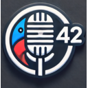

**gpt-5.6-solでフランス語から日本語に翻訳された記事。**

# Babel Fish AI - AI搭載の音声文字起こし・翻訳拡張機能

**公式サイト：[babelfishai.jls42.org](https://babelfishai.jls42.org/)**

[🇸🇦 アラビア語](README-ar.md) | [🇩🇪 ドイツ語](README-de.md) | [🇺🇸 英語](README-en.md) | [🇪🇸 スペイン語](README-es.md) | [🇮🇳 ヒンディー語](README-hi.md) | [🇮🇹 イタリア語](README-it.md) | [🇯🇵 日本語](README-ja.md) | [🇰🇷 韓国語](README-ko.md) | [🇳🇱 オランダ語](README-nl.md) | [🇵🇱 ポーランド語](README-pl.md) | [🇵🇹 ポルトガル語](README-pt.md) | [🇷🇴 ルーマニア語](README-ro.md) | [🇸🇪 スウェーデン語](README-sv.md) | [🇨🇳 中国語](README-zh.md)

**この拡張機能を使用するには、対応しているいずれかのプロバイダーのAPIキーが必要です：**

|                           プロバイダー                           | APIキーの取得方法                                                                                |
| :--------------------------------------------------------------: | :------------------------------------------------------------------------------------------------ |
|  | **Mistral AI**：[console.mistral.ai/api-keys](https://console.mistral.ai/api-keys)               |
|       | **OpenAI**：[platform.openai.com/account/api-keys](https://platform.openai.com/account/api-keys) |
|                                🚅                                | **Custom/LiteLLM**：独自のAPIエンドポイントを使用する場合                                      |

Babel Fish AIは、複数プロバイダーに対応した高性能な音声文字起こしを提供する革新的なブラウザー拡張機能です。Mistral AI（Voxtral）またはOpenAI（Whisper）の文字起こしAPIを使用して、音声を高精度でテキストに変換し、必要に応じてリアルタイムの自動翻訳も利用できます。Babel Fish AIを文字起こし専用として使用することも、必要に応じて即時翻訳を有効にすることもできます。

 

      

## 🌟 機能

-   **高度な音声文字起こし**

    -   デバイスのマイクを使用した高品質な音声収録。
    -   Voxtral（Mistral AI）またはWhisper（OpenAI）のAPIによる高精度な文字起こし。
    -   複数プロバイダーに対応：Mistral AI、OpenAI、またはカスタムエンドポイントから自由に選択できます。
    -   音声認識とテキスト表示の多言語対応により、さまざまな言語の音声入力を文字起こしし、結果（文字起こし、および有効な場合は翻訳）を選択した言語で表示できます。
    -   アクティブな入力欄へのテキストの自動挿入、または専用ダイアログへの表示。

-   **インテリジェントな翻訳と文章改善**

    -   必要に応じて有効にできる、文字起こし結果のさまざまな言語への即時翻訳。
    -   文体と明瞭さを向上させるための文章改善。
    -   原文の意味に忠実な翻訳を実現する高度なAIモデルの使用。
    -   文字起こしのみを使用するか、文字起こしと翻訳を組み合わせるかを自由に選択できます。

-   **高機能なコンテキストメニュー**

    -   選択した文章を即座に改善する「選択範囲を改善」オプション。
    -   利用可能なすべての言語を含むサブメニュー付きの「選択範囲を翻訳」オプション。
    -   スペル、文法、句読点の誤りを修正する「スペルを修正」オプション。
    -   選択したテキストを、翻訳、改善、または修正された文章に直接置換。
    -   ブラウザーのネイティブユーザーインターフェースへの完全な統合。

-   **直感的でカスタマイズ可能なユーザーインターフェース**

    -   柔軟な表示モード：アクティブな入力欄またはフローティングダイアログ。
    -   色、不透明度、表示時間を選択できる設定可能なステータスバナー。
    -   録音を開始・停止するキーボードショートカット（Ctrl+Shift+1、Macでは⌘+Shift+1）。
    -   Firefoxでは、ページエディターがキーの組み合わせを取得するサイト（ChatGPT、Notionなど）向けの「優先ショートカット」を利用できます。インストール時から有効で、オプションから無効化できます（[PRIVACY.md](PRIVACY.md)を参照）。
    -   結果の表示時間を制御する「開いたままにする」オプション。
    -   マイクと数字の「42」を組み合わせ、ひと目で識別できるカスタムアイコン。

-   **高度なオプション**
    -   最大限の柔軟性を実現する、Mistral AI、OpenAI、Custom/LiteLLMへの複数プロバイダー対応。
    -   プロバイダーごとに文字起こしモデルと翻訳モデルをカスタマイズ可能。
    -   利用可能なOpenAIモデル：GPT-4o mini（既定）、GPT-4.1（mini/standard）、**GPT-5.4（nano/mini/standard）**、**GPT-5.6（luna/terra/sol）**。文字起こし：whisper-1（既定）、gpt-4o-mini-transcribe、gpt-4o-transcribe、**gpt-transcribe**。
    -   利用可能なMistralモデル：Mistral Small（既定）、Mistral Medium、Mistral Large、Codestral、**Ministral 3（3B/8B/14B）**。文字起こし：Voxtral Mini。推論を行うMistralモデルの応答（思考ブロック）にも対応しています。
    -   gpt-4.1-nano（OpenAI APIは2026年10月23日に提供終了）またはgpt-4oを使用していた設定は、更新時にそれぞれgpt-5.6-lunaおよびgpt-4.1へ自動的に移行します。
    -   文字起こしと翻訳・文章改善に使用するプロバイダーを個別に選択可能。
    -   Customプロバイダー経由でLiteLLM Proxyと連携し、代替モデルに接続可能。
    -   言語ファイル（\_locales）による完全な国際化対応で、多言語のインターフェースと音声入力に対応。

## 🌐 対応言語

Babel Fish AIが対応している言語と、デモ動画へのリンクは以下のとおりです：

-   [アラビア語](https://www.youtube.com/watch?v=onzOGx7nbUE)
-   [ドイツ語](https://www.youtube.com/watch?v=G1QVF1NTQYE)
-   [英語](https://www.youtube.com/watch?v=QC8WiIszn3Q)
-   [スペイン語](https://www.youtube.com/watch?v=nA93pis4vDQ)
-   [フランス語](https://www.youtube.com/watch?v=ITNFjx7Mgo4)
-   [ヒンディー語](https://www.youtube.com/watch?v=FMEYdwCqoPg)
-   [イタリア語](https://www.youtube.com/watch?v=QgYZt8myods)
-   [日本語](https://www.youtube.com/watch?v=noHEJCnocH8)
-   [韓国語](https://www.youtube.com/watch?v=YrYN75YSH3w)
-   [オランダ語](https://www.youtube.com/watch?v=OnAZHzbd2NQ)
-   [ポーランド語](https://www.youtube.com/watch?v=E5AVNjZYOxM)
-   [ポルトガル語](https://www.youtube.com/watch?v=st0XwCV1tvo)
-   [ルーマニア語](https://www.youtube.com/watch?v=H2IMpU5_Hew)
-   [スウェーデン語](https://www.youtube.com/watch?v=HMMzGyW8000)
-   [中国語](https://www.youtube.com/watch?v=OJe6oVA_Y0s)

## 🚀 インストール

### Chrome

1.  **ダウンロードとインストール：**

    -   このリポジトリをGitHubからクローンするか、拡張機能のフォルダーを手動でダウンロードします。
    -   **または、[Chrome Web Store](https://chromewebstore.google.com/detail/babelfishai-by-jls42org/aahodplbenfmijbeahnhoklpdnmfdmbk)から拡張機能を直接インストールします**
    -   Chromeを開き、`chrome://extensions/`にアクセスします。
    -   右上の「デベロッパーモード」を有効にします。
    -   「パッケージ化されていない拡張機能を読み込む」をクリックし、Babel Fish AIのフォルダーを選択します。

2.  **確認：**
    -   拡張機能がカスタムアイコンとともにブラウザーのツールバーに表示されていることを確認します。

### Firefox

1.  **ダウンロードとインストール：**

    -   **[Firefox Add-ons](https://addons.mozilla.org/firefox/addon/babelfishai-by-jls42-org/)から拡張機能を直接インストールします**
    -   または手動でインストールする場合は、このリポジトリをGitHubからクローンし、`./scripts/build.sh firefox`を実行します。これにより、Firefox用マニフェストの名前を`manifest.json`に変更した`dist/firefox/`が用意されます。
    -   Firefoxを開き、`about:debugging#/runtime/this-firefox`にアクセスします（署名済み拡張機能専用の`about:addons`にある「ファイルからアドオンをインストール」ではありません）。
    -   「一時的なアドオンを読み込む...」をクリックします。
    -   `dist/firefox/manifest.json`ファイルを選択します。

2.  **確認：**
    -   拡張機能がカスタムアイコンとともにFirefoxのツールバーに表示されていることを確認します。

## ⚙️ 設定

1.  **AIプロバイダーの設定：**

    -   拡張機能のアイコンをクリックしてオプションを開きます。
    -   ドロップダウンメニューからプロバイダー（Mistral AI、OpenAI、またはCustom/LiteLLM）を選択します。
    -   APIキーを入力します：
        -   **Mistral AI**：[console.mistral.ai/api-keys](https://console.mistral.ai/api-keys)で取得できます
        -   **OpenAI**：[platform.openai.com/account/api-keys](https://platform.openai.com/account/api-keys)で取得できます
    -   ドロップダウンメニューの横にある切り替えスイッチでプロバイダーを有効にします。

2.  **オプションのカスタマイズ：**

    -   表示モード（アクティブな入力欄またはダイアログ）を選択します。
    -   ステータスバナーの色、不透明度、表示時間を設定します。
    -   文字起こし（音声入力）とテキスト表示に使用する言語を選択します。
    -   必要に応じて翻訳機能を有効または無効にします。

3.  **（任意）モデルの詳細設定：**
    -   各プロバイダーのオプションで「モデル設定」をクリックし、使用するモデルをカスタマイズします。
    -   文字起こし、および翻訳・文章改善用のカスタムモデルを追加できます。
    -   複数のプロバイダーが有効な場合、各サービス（文字起こしと翻訳）に使用するプロバイダーを選択できます。

## 🚀 LiteLLM Proxyまたはカスタムエンドポイントとの併用

Babel Fish AIは[LiteLLM Proxy](https://litellm.ai/)およびOpenAI互換のその他のAPIプロキシに対応しており、代替言語モデルを使用できます。

### 設定

1.  **プロキシをインストールして設定します：** 使用するサービス（LiteLLMなど）の手順に従ってください。
2.  **Babel Fish AI拡張機能を設定します：**
    -   拡張機能のオプションで、ドロップダウンメニューから**Custom/LiteLLM**プロバイダーを選択します。
    -   APIキーを入力します（必要な場合）。
    -   APIのURLを設定します：
        -   **文字起こしURL**：例 `http://localhost:4000/v1/audio/transcriptions`
        -   **チャットURL**：例 `http://localhost:4000/v1/chat/completions`
    -   切り替えスイッチでプロバイダーを有効にします。
    -   LiteLLMによるリクエストのログ記録を無効にする場合は、**「NoLog」**オプションをオンにします。

**重要：**「NoLog」オプションはCustom/LiteLLMプロバイダーで**のみ**利用できます。OpenAIまたはMistral AIの公式APIには対応していません。

## 🛠️ 技術的な仕組み

### 拡張機能のアーキテクチャ

この拡張機能は、相互に連携する複数のJavaScriptファイルで構成されています：

#### 主要ファイル

-   **`manifest.json`：** 拡張機能の主要な設定ファイルです。権限、スクリプト、アクセス可能なリソースなどを定義します。マニフェストバージョン3を使用し、`activeTab`、`storage`、`commands`、`scripting`、`contextMenus`の権限を宣言しています。
-   **`background.js`：** バックグラウンドで実行されるサービスワーカーです。イベント（アイコンのクリック、キーボードショートカット、コンテキストメニュー）を処理し、必要に応じて`content script`を挿入して、`content script`と通信します。
-   **`content.js`：** Webページに挿入されるメインスクリプトです。各種ユーティリティモジュールを統括し、拡張機能全体の処理フローを管理します。
-   **`src/constants.js`：** 設定、状態、アクションなどの定数を定義します。

#### ユーティリティモジュール

この拡張機能では、複数の専用ユーティリティファイルで構成されたモジュール式アーキテクチャを採用しています：

##### プロバイダーとAPIの管理

-   **`src/utils/providers.js`：** AIプロバイダー（Mistral AI、OpenAI、Custom/LiteLLM）の設定、モデル、既定URLを含むレジストリです。
-   **`src/utils/api-utils.js`：** 外部APIとの連携、複数プロバイダー設定の解決、音声文字起こしを行う関数です。
-   **`src/utils/text-processing.js`：** 翻訳、文章改善、スペル修正などのテキスト処理関数です。

##### ユーザーインターフェースと操作

-   **`src/utils/ui.js`：** ユーザーインターフェース用の汎用ユーティリティ関数です。
-   **`src/utils/banner-utils.js`：** ステータスバナー、そのコントロール、言語選択を管理します。
-   **`src/utils/focus-utils.js`：** フォーカスとテキスト選択範囲の保存および復元を管理します。
-   **`src/utils/transcription-display.js`：** 文字起こし結果の表示を管理します。
-   **`src/utils/error-utils.js`：** エラーの表示と処理を管理します。
-   **`src/styles/content.css`：** Webページに挿入されるユーザーインターフェース用のCSSスタイルです。

##### 録音とイベント

-   **`src/utils/recording-utils.js`：** マイクによる音声録音と音声データの処理を管理します。
-   **`src/utils/event-handlers.js`：** ユーザー操作用のイベントハンドラーが含まれています。

##### 国際化と言語

-   **`src/utils/languages.js`：** 拡張機能が対応している言語を定義します。
-   **`src/utils/languages-shared.js`：** Webページのコンテキストで対応している言語の一覧を定義します。
-   **`src/utils/languages-data.js`：** サービスワーカーで対応している言語の一覧を定義します。
-   **`src/utils/i18n.js`：** ユーザーインターフェースの国際化を管理します。

##### オプションページ

-   **`src/pages/options/`：** 拡張機能のオプションページ用ファイル（HTML、CSS、JavaScript）が含まれています。

### 文字起こしと翻訳の処理

#### 主要な音声文字起こし機能

1.  **録音の開始：** ユーザーが拡張機能のアイコンをクリックするか、キーボードショートカット（Ctrl+Shift+1、Macでは⌘+Shift+1）を使用して録音を開始します。`background script`が`content script`にメッセージを送信し、録音を開始します。
2.  **音声の収録：** `content script`が`navigator.mediaDevices.getUserMedia` APIを使用してマイクへアクセスし、MediaRecorder APIで音声を録音します。
3.  **文字起こし：** `content script`が`transcribeAudio`関数（`src/utils/api-utils.js`）を使用して、設定されたプロバイダーの文字起こしAPI（Mistral AIではVoxtral、OpenAIではWhisper）に音声を送信します。APIから文字起こしされたテキストが返されます。
4.  **翻訳または文章改善（任意）：**

-   翻訳オプションが有効な場合、`content script`が`translateText`関数（`src/utils/text-processing.js`）を使用して、設定されたプロバイダーのチャットAPIに文字起こしされたテキストを送信します。
-   文章改善オプションが有効な場合は、`rephraseText`関数を使用して文字起こしされたテキストを改善します。

5.  **表示：** `content script`が、処理済みのテキストをページ上のアクティブな要素（テキスト入力欄または編集可能な要素の場合）に表示するか、カスタムダイアログに表示します。

#### コンテキストメニュー機能

1. **テキストの選択：** ユーザーがWebページ上のテキストを選択します。
2. **コンテキストメニュー：** 右クリックすると次のオプションが表示されます：
    - 文体と明瞭さを改善する「選択範囲を改善」
    - 利用可能な言語のサブメニューを含む「選択範囲を翻訳」
    - 誤りを修正する「スペルを修正」
3. **処理：** 選択したオプションに応じて：
    - `rephraseText`関数を使用して、文章改善のためにテキストを送信します
    - 選択した対象言語とともに`translateText`関数を使用して、翻訳のためにテキストを送信します
    - `correctText`関数を使用して、修正のためにテキストを送信します
4. **表示：** 選択されたテキストが存在する要素内で、処理結果が元の選択範囲を置き換えます。

### 通信

`background script`と`content script`の間の通信は、ChromeのメッセージングAPI（`chrome.runtime.sendMessage`および`chrome.runtime.onMessage`）を介して行われます。

### データの保存

この拡張機能は、次の情報を保存するために`chrome.storage.sync`を使用します：

-   AIプロバイダーの設定（APIキー、選択したモデル、カスタムURL）。
-   拡張機能のオプション（表示、翻訳、バナーの色など）。
-   翻訳用の言語設定。

これらのデータは、お使いのコンピューター上にあるブラウザー拡張機能のストレージへローカルに保存されます。
### エラー管理

発生する可能性のあるエラー（API キーの欠如、文字起こしエラーなど）は、`constants.js` ファイルで定義されています。`api-utils.js` 関数と `text-processing.js` 関数は、HTTP コードに応じて改善されたメッセージを使用し、API 呼び出しで発生する可能性のあるエラーを処理します。`content.js` は、ページ下部のバナーを介してユーザーにエラーメッセージを表示します。

## 🛡️ セキュリティとプライバシー

-   **データ保護：**
    -   API キーはブラウザ内に安全に保存されます。
    -   この拡張機能は音声データを保存しません。すべての処理はリアルタイムで行われます。
    -   API との通信には、安全な HTTPS 接続が使用されます。

BabelFishAI によるデータの取り扱いに関する詳細については、[プライバシーポリシー](PRIVACY.md)をご覧ください。

## 🔧 トラブルシューティング

-   **マイクの問題：**

    -   ブラウザでマイクへのアクセス権限を確認してください。
    -   他のアプリケーションが同時にマイクを使用していないことを確認してください。

-   **文字起こし／翻訳エラー：**
    -   API キーが有効かつ使用可能であることを確認してください。
    -   安定したインターネット接続があることを確認してください。
    -   エラーが発生した場合は、詳細なログを確認するためにブラウザのコンソールをご覧ください。

## 🤝 コントリビューション

貢献やご提案を歓迎します。貢献するには：

-   GitHub の Issues セクションからバグを報告してください。
-   改善案や新機能をご提案ください。
-   pull request を送信してください。

## 📄 ライセンス

この拡張機能は GNU Affero General Public License v3.0（AGPL-3.0）の下で配布されています。詳細については LICENSE ファイルをご覧ください。

## 💝 サポート

## この拡張機能を気に入っていただけましたら、[PayPal](https://paypal.me/jls) から寄付を行い、開発を支援していただけます。

jls42.org が情熱と革新をもって開発した Babel Fish AI は、最先端の人工知能によって文字起こしと翻訳を新たな地平へと導きます。
