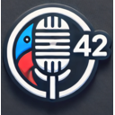

**Artikel översatt från franska till svenska med gpt-5.6-sol.**

# Babel Fish AI – tillägg för rösttranskribering och översättning med AI

**Officiell webbplats: [babelfishai.jls42.org](https://babelfishai.jls42.org/)**

[🇸🇦 العربية](README-ar.md) | [🇩🇪 Deutsch](README-de.md) | [🇺🇸 English](README-en.md) | [🇪🇸 Español](README-es.md) | [🇮🇳 हिन्दी](README-hi.md) | [🇮🇹 Italiano](README-it.md) | [🇯🇵 日本語](README-ja.md) | [🇰🇷 한국어](README-ko.md) | [🇳🇱 Nederlands](README-nl.md) | [🇵🇱 Polski](README-pl.md) | [🇵🇹 Português](README-pt.md) | [🇷🇴 Română](README-ro.md) | [🇸🇪 Svenska](README-sv.md) | [🇨🇳 中文](README-zh.md)

**För att använda tillägget behöver du en API-nyckel från en av de leverantörer som stöds:**

|                            Leverantör                            | Skaffa en API-nyckel                                                                            |
| :--------------------------------------------------------------: | :------------------------------------------------------------------------------------------------ |
|  | **Mistral AI**: [console.mistral.ai/api-keys](https://console.mistral.ai/api-keys)                                             |
|       | **OpenAI**: [platform.openai.com/account/api-keys](https://platform.openai.com/account/api-keys)                                        |
|       | **Gemini (Google)**: [aistudio.google.com/apikey](https://aistudio.google.com/apikey)                                         |
|                                🚅                                | **Custom/LiteLLM**: För att använda dina egna API-endpoints                                       |

Babel Fish AI är ett innovativt webbläsartillägg som erbjuder kraftfull rösttranskribering med stöd för flera leverantörer. Omvandla din röst till text med anmärkningsvärd precision tack vare transkriberings-API:erna från Mistral AI (Voxtral), OpenAI (gpt-transcribe, Whisper) eller Gemini (Gemini 3.5 Transcribe), och få dessutom valfri automatisk översättning i realtid. Du kan använda Babel Fish AI enbart för transkribering eller aktivera direktöversättning efter behov.

 

      

## 🌟 Funktioner

-   **Avancerad rösttranskribering**

    -   Ljudinspelning med hög kvalitet via enhetens mikrofon.
    -   Exakt transkribering via API:erna Voxtral (Mistral AI), gpt-transcribe och Whisper (OpenAI) eller Gemini 3.5 Transcribe (Google).
    -   Stöd för flera leverantörer: välj fritt mellan Mistral AI, OpenAI, Gemini eller en anpassad endpoint.
    -   Flerspråkigt stöd för taligenkänning och textvisning, vilket gör det möjligt att transkribera röstinmatning på olika språk och visa resultaten (transkribering och översättning, om aktiverad) på önskat språk.
    -   Automatisk infogning av texten i det aktiva fältet eller visning i en särskild dialogruta.

-   **Intelligent översättning och omformulering**

    -   Omedelbar översättning av transkriberingar till olika språk, som kan aktiveras vid behov.
    -   Omformulering av text för att förbättra dess stil och tydlighet.
    -   Användning av en avancerad AI-modell för att säkerställa en översättning som är trogen originalets innebörd.
    -   Fritt val mellan att enbart använda transkribering eller att kombinera transkribering och översättning.

-   **Kraftfull snabbmeny**

    -   Alternativet ”Omformulera markeringen” för att omedelbart förbättra markerade texter.
    -   Alternativet ”Översätt markeringen” med en undermeny över alla tillgängliga språk.
    -   Alternativet ”Korrigera stavningen” för att rätta stavfel, grammatiska fel och skiljetecken.
    -   Direkt ersättning av den markerade texten med dess översatta, omformulerade eller korrigerade version.
    -   Sömlös integrering i webbläsarens inbyggda användargränssnitt.

-   **Intuitivt och anpassningsbart användargränssnitt**

    -   Flexibelt visningsläge: aktivt inmatningsfält eller flytande dialogruta.
    -   Konfigurerbar statusbanner med val av färg, opacitet och visningstid.
    -   Kortkommando (Ctrl+Shift+1 eller ⌘+Shift+1 på Mac) för att starta/stoppa inspelningen.
    -   I Firefox finns ett ”prioriterat kortkommando” för webbplatser vars sidredigerare fångar upp tangentkombinationen (ChatGPT, Notion …): det är aktivt direkt efter installationen och kan inaktiveras i inställningarna (se [PRIVACY.md](PRIVACY.md)).
    -   Alternativet ”Håll öppen” för att styra hur länge resultaten visas.
    -   Anpassad ikon med en mikrofon och siffran ”42” för omedelbar igenkänning.

-   **Avancerade alternativ**
    -   Stöd för flera leverantörer: Mistral AI, OpenAI, Gemini och Custom/LiteLLM för maximal flexibilitet.
    -   Möjlighet att anpassa transkriberings- och översättningsmodellerna för varje leverantör.
    -   Tillgängliga OpenAI-modeller: GPT-4o mini (standard), GPT-4.1 (mini/standard), **GPT-5.4 (nano/mini/standard)** och **GPT-5.6 (luna/terra/sol)**. Transkribering: **gpt-transcribe** (standard), whisper-1, gpt-4o-mini-transcribe och gpt-4o-transcribe. OpenAI tar bort de tre sistnämnda från sitt API den 26/02/2027; en modell som redan har valts i inställningarna fortsätter att användas fram till dess.
    -   Tillgängliga Mistral-modeller: Mistral Small (standard), Mistral Medium, Mistral Large, Codestral och **Ministral 3 (3B/8B/14B)**. Transkribering: Voxtral Mini. Svar från resonerande Mistral-modeller (resonemangsblock) stöds.
    -   Tillgängliga Gemini-modeller: **Gemini 3.8 Flash** (standard, med minskat resonemang för svar inom en till två sekunder) och **Gemini 3.5 Flash-Lite** (snabbast). Transkribering: **Gemini 3.5 Transcribe**, via Googles Interactions API, utan att dikteringar sparas i historiken för detta API (`store: false`, se [docs/providers/gemini.md](docs/providers/gemini.md)).
    -   Inställningar som använde gpt-4.1-nano (OpenAI-API:t upphör den 23/10/2026) eller gpt-4o byter automatiskt till gpt-5.6-luna respektive gpt-4.1 vid uppdateringen.
    -   Oberoende val av leverantör för transkribering respektive översättning/omformulering.
    -   Kompatibilitet med LiteLLM Proxy via leverantören Custom för anslutning till alternativa modeller.
    -   Fullständig hantering av internationalisering tack vare språkfilerna (\_locales), vilket ger ett flerspråkigt gränssnitt och röststöd.

## 🌐 Språk som stöds

Här är listan över språk som stöds av Babel Fish AI, med länkar till demonstrationsvideor:

-   [Arabiska](https://www.youtube.com/watch?v=onzOGx7nbUE)
-   [Tyska](https://www.youtube.com/watch?v=G1QVF1NTQYE)
-   [Engelska](https://www.youtube.com/watch?v=QC8WiIszn3Q)
-   [Spanska](https://www.youtube.com/watch?v=nA93pis4vDQ)
-   [Franska](https://www.youtube.com/watch?v=ITNFjx7Mgo4)
-   [Hindi](https://www.youtube.com/watch?v=FMEYdwCqoPg)
-   [Italienska](https://www.youtube.com/watch?v=QgYZt8myods)
-   [Japanska](https://www.youtube.com/watch?v=noHEJCnocH8)
-   [Koreanska](https://www.youtube.com/watch?v=YrYN75YSH3w)
-   [Nederländska](https://www.youtube.com/watch?v=OnAZHzbd2NQ)
-   [Polska](https://www.youtube.com/watch?v=E5AVNjZYOxM)
-   [Portugisiska](https://www.youtube.com/watch?v=st0XwCV1tvo)
-   [Rumänska](https://www.youtube.com/watch?v=H2IMpU5_Hew)
-   [Svenska](https://www.youtube.com/watch?v=HMMzGyW8000)
-   [Kinesiska](https://www.youtube.com/watch?v=OJe6oVA_Y0s)

## 🚀 Installation

### Chrome

1.  **Hämtning och installation:**

    -   Klona detta arkiv från GitHub eller hämta tilläggets mapp manuellt.
    -   **Eller installera tillägget direkt från [Chrome Web Store](https://chromewebstore.google.com/detail/babelfishai-by-jls42org/aahodplbenfmijbeahnhoklpdnmfdmbk)**
    -   Öppna Chrome och gå till `chrome://extensions/`.
    -   Aktivera ”Utvecklarläge” längst upp till höger.
    -   Klicka på ”Läs in okomprimerat tillägg” och välj mappen för Babel Fish AI.

2.  **Kontroll:**
    -   Kontrollera att tillägget visas i webbläsarens verktygsfält med den anpassade ikonen.

### Firefox

1.  **Hämtning och installation:**

    -   **Firefox 140 eller senare** (dator) krävs från och med version 1.2.0. Vid installationen och vid uppdatering till 1.2.0 visar Firefox vilka data som tillägget skickar till den leverantör du konfigurerar: din röst, den markerade eller dikterade texten samt din API-nyckel (se [PRIVACY.md](PRIVACY.md)).
    -   **Installera tillägget direkt från [Firefox Add-ons](https://addons.mozilla.org/firefox/addon/babelfishai-by-jls42-org/)**
    -   Eller för manuell installation: klona detta arkiv från GitHub och kör sedan `./scripts/build.sh firefox`, som förbereder `dist/firefox/` med Firefox-manifestet omdöpt till `manifest.json`.
    -   Öppna Firefox och gå till `about:debugging#/runtime/this-firefox` (inte ”Installera tillägg från fil” i `about:addons`, som är avsett för signerade tillägg).
    -   Klicka på ”Läs in tillfälligt tillägg …”.
    -   Välj filen `dist/firefox/manifest.json`.

2.  **Kontroll:**
    -   Kontrollera att tillägget visas i Firefox verktygsfält med den anpassade ikonen.

## ⚙️ Konfiguration

1.  **Konfiguration av AI-leverantör:**

    -   Klicka på tilläggsikonen för att öppna inställningarna.
    -   Välj leverantör i rullgardinsmenyn (Mistral AI, OpenAI, Gemini eller Custom/LiteLLM).
    -   Ange din API-nyckel:
        -   **Mistral AI**: finns på [console.mistral.ai/api-keys](https://console.mistral.ai/api-keys)
        -   **OpenAI**: finns på [platform.openai.com/account/api-keys](https://platform.openai.com/account/api-keys)
        -   **Gemini**: finns på [aistudio.google.com/apikey](https://aistudio.google.com/apikey). Använd helst en nyckel från ett projekt med fakturering: om du använder en kostnadsfri nyckel och befinner dig utanför Europeiska ekonomiska samarbetsområdet, Schweiz och Storbritannien kan Google använda dina dikteringar och skickade texter för att förbättra sina produkter, eventuellt med mänsklig granskning. Skicka därför ingen personlig, känslig eller konfidentiell information. Begränsa nyckeln till Gemini API (standardinställningen för nya nycklar), aldrig till webbplatser: i Chrome skickas förfrågningarna från sidan där du dikterar.
    -   Aktivera leverantören med reglaget bredvid rullgardinsmenyn.

2.  **Anpassning av alternativ:**

    -   Välj visningsläge (aktivt fält eller dialogruta).
    -   Konfigurera statusbannerns färg, opacitet och visningstid.
    -   Välj språk för transkribering (röstinmatning) och för textvisning.
    -   Aktivera eller inaktivera översättningsfunktionen efter behov.

3.  **(Valfritt) Avancerad modellkonfiguration:**

    -   Klicka på ”Modellkonfiguration” i inställningarna för varje leverantör för att anpassa modellerna som används.
    -   Du kan lägga till anpassade modeller för transkribering och översättning/omformulering.
    -   Om flera leverantörer är aktiverade kan du välja vilken som ska användas för respektive tjänst (transkribering och översättning).

4.  **Flera synkroniserade enheter:**
    -   Uppdatera tillägget på alla dina enheter. En version som är äldre än 1.2.0 känner inte till Gemini: om Gemini har valts använder den en äldre leverantör som du har aktiverat eller skickar ingenting.
    -   Om en nyare version av tillägget har sparat en leverantör som din version ännu inte känner till visas detta på inställningssidan i avsnittet ”Leverantörer från en nyare version”, med en knapp för att radera dess inställningar från alla dina enheter.
    -   Om webbläsaren vägrar att spara dina inställningar (till exempel på grund av ett för långt värde) visar sidan felet i stället för ”Inställningarna har sparats!” och sparar ingenting.

## 🚀 Användning med LiteLLM Proxy eller anpassade endpoints

Babel Fish AI är kompatibelt med [LiteLLM Proxy](https://litellm.ai/) och andra OpenAI-kompatibla API-proxyservrar, vilket gör det möjligt att använda alternativa språkmodeller.

### Konfiguration

1.  **Installera och konfigurera din proxy:** Följ anvisningarna för tjänsten du använder (LiteLLM osv.).
2.  **Konfigurera tillägget Babel Fish AI:**
    -   Välj leverantören **Custom/LiteLLM** i rullgardinsmenyn i tilläggets inställningar.
    -   Ange din API-nyckel (om det behövs).
    -   Konfigurera API-URL:erna:
        -   **URL för transkribering**: till exempel `http://localhost:4000/v1/audio/transcriptions`
        -   **URL för chatt**: till exempel `http://localhost:4000/v1/chat/completions`
    -   Aktivera leverantören med reglaget.
    -   Markera alternativet **”NoLog”** om du vill inaktivera LiteLLM:s loggning av förfrågningar.

**Viktigt:** Alternativet ”NoLog” är **endast** tillgängligt för leverantören Custom/LiteLLM. Det är inte kompatibelt med de officiella API:erna från OpenAI, Mistral AI eller Gemini.

## 🛠️ Teknisk funktion

### Tilläggets arkitektur

Tillägget består av flera JavaScript-filer som samverkar:

#### Huvudfiler

-   **`manifest.json`:** Tilläggets huvudsakliga konfigurationsfil. Den definierar behörigheter, skript, åtkomliga resurser osv. Den använder manifestversion 3 och deklarerar behörigheterna `activeTab`, `storage`, `commands`, `scripting` och `contextMenus`.
-   **`background.js`:** Den service worker som körs i bakgrunden. Den hanterar händelser (klick på ikonen, kortkommandon, snabbmeny), injicerar `content script` vid behov och kommunicerar med `content script`.
-   **`content.js`:** Huvudskriptet som injiceras på webbsidor. Det samordnar de olika hjälpmodulerna och hanterar tilläggets övergripande flöde.
-   **`src/constants.js`:** Definierar konstanter för konfiguration, tillstånd, åtgärder osv.

#### Hjälpmoduler

Tillägget använder en modulär arkitektur med flera specialiserade hjälpfiler:

##### Hantering av leverantörer och API:er

-   **`src/utils/providers.js`:** Register över AI-leverantörer (Mistral AI, OpenAI, Gemini, Custom/LiteLLM) med deras konfigurationer, modeller och standard-URL:er.
-   **`src/utils/provider-store.js`:** Läser leverantörsinställningarna från lagringen och kontrollerar att en API-nyckel endast skickas till leverantörens adresser.
-   **`src/utils/provider-adapters.js`:** Leverantörernas API-format: autentisering, innehåll i förfrågningar samt läsning av svar och fel.
-   **`src/utils/api-utils.js`:** Funktioner för interaktion med externa API:er, lösning av konfigurationen med flera leverantörer och ljudtranskribering.
-   **`src/utils/text-processing.js`:** Funktioner för textbehandling: översättning, omformulering och stavningskorrigering.

##### Användargränssnitt och interaktion

-   **`src/utils/ui.js`:** Allmänna hjälpfunktioner för användargränssnittet.
-   **`src/utils/banner-utils.js`:** Hanterar statusbannern, dess kontroller och språkväljaren.
-   **`src/utils/focus-utils.js`:** Hanterar sparande och återställning av fokus och textmarkering.
-   **`src/utils/transcription-display.js`:** Hanterar visningen av transkriberingsresultat.
-   **`src/utils/error-utils.js`:** Hanterar visning och behandling av fel.
-   **`src/styles/content.css`:** CSS-stilar för användargränssnittet som injiceras på webbsidor.

##### Inspelning och händelser

-   **`src/utils/recording-utils.js`:** Hanterar ljudinspelning via mikrofonen och bearbetning av ljuddata.
-   **`src/utils/event-handlers.js`:** Innehåller händelsehanterare för användarinteraktioner.

##### Internationalisering och språk

-   **`src/utils/languages.js`:** Definierar språken som stöds av tillägget.
-   **`src/utils/languages-shared.js`:** Definierar listan över språk som stöds i webbsidans kontext.
-   **`src/utils/languages-data.js`:** Definierar listan över språk som stöds för service workern.
-   **`src/utils/i18n.js`:** Hanterar internationalisering av användargränssnittet.

##### Inställningssida

-   **`src/pages/options/`:** Innehåller filerna för tilläggets inställningssida (HTML, CSS, JavaScript).
### Process för transkribering och översättning

#### Huvudfunktion för rösttranskribering

1.  **Starta inspelningen:** Användaren startar inspelningen genom att klicka på tilläggets ikon eller använda kortkommandot (Ctrl+Shift+1 eller ⌘+Shift+1 på Mac). `background script` skickar ett meddelande till `content script` för att starta inspelningen.
2.  **Ljudinspelning:** `content script` använder API:et `navigator.mediaDevices.getUserMedia` för att få åtkomst till mikrofonen och spela in ljud via MediaRecorder-API:et.
3.  **Transkribering:** `content script` använder funktionen `transcribeAudio` (`src/utils/api-utils.js`) för att skicka ljudet till transkriberings-API:et hos den konfigurerade leverantören (Voxtral för Mistral AI, gpt-transcribe eller Whisper för OpenAI, Gemini 3.5 Transcribe för Gemini). API:et returnerar den transkriberade texten.
4.  **Översättning eller omformulering (valfritt):**

-   Om översättningsalternativet är aktiverat använder `content script` funktionen `translateText` (`src/utils/text-processing.js`) för att skicka den transkriberade texten till chatt-API:et hos den konfigurerade leverantören.
-   Om omformuleringsalternativet är aktiverat används funktionen `rephraseText` för att förbättra den transkriberade texten.

5.  **Visning:** `content script` visar den bearbetade texten antingen i det aktiva elementet på sidan (om det är ett textfält eller ett redigerbart element) eller i en anpassad dialogruta.

#### Funktion för snabbmeny

1. **Markera text:** Användaren markerar text på en webbsida.
2. **Snabbmeny:** Ett högerklick visar alternativen:
    - ”Omformulera markeringen” för att förbättra stil och tydlighet
    - ”Översätt markeringen” med en undermeny över tillgängliga språk
    - ”Korrigera stavningen” för att rätta fel
3. **Bearbetning:** Beroende på valt alternativ:
    - Texten skickas för omformulering via funktionen `rephraseText`
    - Texten skickas för översättning via funktionen `translateText` med det valda målspråket
    - Texten skickas för korrigering via funktionen `correctText`
4. **Visning:** Resultatet ersätter den ursprungliga markeringen i elementet där den markerade texten finns.

### Kommunikation

Kommunikationen mellan `background script` och `content script` sker via Chromes meddelande-API (`chrome.runtime.sendMessage` och `chrome.runtime.onMessage`).

### Datalagring

Tillägget använder `chrome.storage.sync` för att lagra:

-   Konfigurationen för AI-leverantörer (API-nycklar, valda modeller, anpassade URL:er). Gemini, som lades till i 1.2.0, har en egen lagringsnyckel (`extraProvider.gemini`), som tidigare versioner ignorerar.
-   Tilläggets alternativ (visning, översättning, banderollfärger osv.).
-   Språkinställningarna för översättning.

Dessa data lagras lokalt på din dator i webbläsartilläggets lagringsutrymme.

### Felhantering

Möjliga fel (saknad API-nyckel, transkriberingsfel osv.) definieras i filen `constants.js`. Funktionerna `api-utils.js` och `text-processing.js` hanterar potentiella fel vid API-anrop med förbättrade meddelanden beroende på HTTP-koden. `content.js` visar felmeddelanden för användaren via en banderoll längst ned på sidan.

## 🛡️ Säkerhet och integritet

-   **Dataskydd:**
    -   API-nyckeln lagras säkert i webbläsaren.
    -   Tillägget sparar inte dina ljuddata; all bearbetning sker i realtid.
    -   Kommunikationen med API:erna sker via säkra HTTPS-anslutningar.

Fullständig information om hur BabelFishAI hanterar dina data finns i vår [integritetspolicy](PRIVACY.md).

## 🔧 Felsökning

-   **Mikrofonproblem:**

    -   Kontrollera behörigheterna för mikrofonåtkomst i din webbläsare.
    -   Se till att inget annat program använder mikrofonen samtidigt.

-   **Transkriberings-/översättningsfel:**
    -   Kontrollera att API-nyckeln är giltig och aktiv.
    -   Se till att du har en stabil internetanslutning.
    -   Kontrollera webbläsarkonsolen för detaljerade loggar om ett fel uppstår.

## 🤝 Bidrag

Bidrag och förslag är välkomna. Så här bidrar du:

-   Rapportera buggar via sektionen Issues på GitHub.
-   Föreslå förbättringar eller nya funktioner.
-   Skicka in dina pull requests.

## 📄 Licens

Detta tillägg distribueras under licensen GNU Affero General Public License v3.0 (AGPL-3.0). Se filen LICENSE för mer information.

## 💝 Stöd

## Om du uppskattar detta tillägg kan du stödja utvecklingen genom att donera via [PayPal](https://paypal.me/jls).

Babel Fish AI har utvecklats av jls42.org med passion och innovation och tar transkribering och översättning till nya höjder med hjälp av banbrytande artificiell intelligens.
