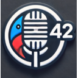

# Babel Fish AI - Extension de Transcription Vocale et Traduction avec IA

**Site officiel : [babelfishai.jls42.org](https://babelfishai.jls42.org/)**

[🇸🇦 العربية](README-ar.md) | [🇩🇪 Deutsch](README-de.md) | [🇺🇸 English](README-en.md) | [🇪🇸 Español](README-es.md) | [🇮🇳 हिन्दी](README-hi.md) | [🇮🇹 Italiano](README-it.md) | [🇯🇵 日本語](README-ja.md) | [🇰🇷 한국어](README-ko.md) | [🇳🇱 Nederlands](README-nl.md) | [🇵🇱 Polski](README-pl.md) | [🇵🇹 Português](README-pt.md) | [🇷🇴 Română](README-ro.md) | [🇸🇪 Svenska](README-sv.md) | [🇨🇳 中文](README-zh.md)

**Pour utiliser l'extension, vous aurez besoin d'une clé API d'un des providers supportés :**

|                             Provider                             | Obtenir une clé API                                                                               |
| :--------------------------------------------------------------: | :------------------------------------------------------------------------------------------------ |
|  | **Mistral AI** : [console.mistral.ai/api-keys](https://console.mistral.ai/api-keys)               |
|       | **OpenAI** : [platform.openai.com/account/api-keys](https://platform.openai.com/account/api-keys) |
|                                🚅                                | **Custom/LiteLLM** : Pour utiliser vos propres endpoints API                                      |

Babel Fish AI est une extension de navigateur innovante conçue pour offrir une transcription vocale puissante avec support multi-provider. Transformez votre voix en texte avec une précision remarquable grâce aux API de transcription de Mistral AI (Voxtral) ou OpenAI (Whisper), et bénéficiez en option d'une traduction automatique en temps réel. Vous pouvez utiliser Babel Fish AI exclusivement pour la transcription ou activer la traduction à la volée selon vos besoins.

 

      

## 🌟 Fonctionnalités

-   **Transcription Vocale Avancée**

    -   Capture audio de haute qualité via le microphone de votre appareil.
    -   Transcription précise via les API Voxtral (Mistral AI) ou Whisper (OpenAI).
    -   Support multi-provider : choisissez librement entre Mistral AI, OpenAI ou un endpoint personnalisé.
    -   Prise en charge multilingue pour la reconnaissance vocale et l'affichage du texte, permettant de transcrire des entrées vocales dans différentes langues et d'afficher les résultats (transcription et traduction, si activée) dans la langue de votre choix.
    -   Insertion automatique du texte dans le champ actif ou affichage dans une boîte de dialogue dédiée.

-   **Traduction et Reformulation Intelligentes**

    -   Traduction immédiate des transcriptions en diverses langues, à activer si besoin.
    -   Reformulation du texte pour améliorer son style et sa clarté.
    -   Utilisation d'un modèle d'IA avancé pour garantir une traduction fidèle au sens original.
    -   Choix libre d'utiliser exclusivement la transcription ou de combiner transcription et traduction.

-   **Menu Contextuel Puissant**

    -   Option "Reformuler la sélection" pour améliorer instantanément vos textes sélectionnés.
    -   Option "Traduire la sélection" avec sous-menu de toutes les langues disponibles.
    -   Option "Corriger l'orthographe" pour corriger les fautes d'orthographe, grammaire et ponctuation.
    -   Remplacement direct du texte sélectionné par sa version traduite, reformulée ou corrigée.
    -   Parfaite intégration dans l'interface utilisateur native du navigateur.

-   **Interface Utilisateur Intuitive et Personnalisable**

    -   Mode d'affichage flexible : zone de saisie active ou fenêtre de dialogue flottante.
    -   Bandeau de statut configurable avec choix des couleurs, de l'opacité et de la durée d'affichage.
    -   Raccourci clavier (Ctrl+Shift+1 ou ⌘+Shift+1 sur Mac) pour démarrer/arrêter l'enregistrement.
    -   Option "Garder ouvert" pour contrôler la durée d'affichage des résultats.
    -   Icône personnalisée, intégrant un microphone et le chiffre "42", pour une reconnaissance immédiate.

-   **Options Avancées**
    -   Support multi-provider : Mistral AI, OpenAI, et Custom/LiteLLM pour une flexibilité maximale.
    -   Possibilité de personnaliser les modèles de transcription et de traduction par provider.
    -   Modèles OpenAI disponibles : familles GPT-4o, GPT-4.1, **GPT-5.4 (nano/mini/standard)** et **GPT-5.5**.
    -   Sélection indépendante du provider pour la transcription et la traduction/reformulation.
    -   Compatibilité avec LiteLLM Proxy via le provider Custom pour vous connecter à des modèles alternatifs.
    -   Gestion complète de l'internationalisation grâce aux fichiers de langue (\_locales), offrant une interface et une prise en charge vocale en plusieurs langues.

## 🌐 Langues Supportées

Voici la liste des langues supportées par Babel Fish AI, avec des liens vers des vidéos de démonstration :

-   [Arabe](https://www.youtube.com/watch?v=onzOGx7nbUE)
-   [Allemand](https://www.youtube.com/watch?v=G1QVF1NTQYE)
-   [Anglais](https://www.youtube.com/watch?v=QC8WiIszn3Q)
-   [Espagnol](https://www.youtube.com/watch?v=nA93pis4vDQ)
-   [Français](https://www.youtube.com/watch?v=ITNFjx7Mgo4)
-   [Hindi](https://www.youtube.com/watch?v=FMEYdwCqoPg)
-   [Italien](https://www.youtube.com/watch?v=QgYZt8myods)
-   [Japonais](https://www.youtube.com/watch?v=noHEJCnocH8)
-   [Coréen](https://www.youtube.com/watch?v=YrYN75YSH3w)
-   [Néerlandais](https://www.youtube.com/watch?v=OnAZHzbd2NQ)
-   [Polonais](https://www.youtube.com/watch?v=E5AVNjZYOxM)
-   [Portugais](https://www.youtube.com/watch?v=st0XwCV1tvo)
-   [Roumain](https://www.youtube.com/watch?v=H2IMpU5_Hew)
-   [Suédois](https://www.youtube.com/watch?v=HMMzGyW8000)
-   [Chinois](https://www.youtube.com/watch?v=OJe6oVA_Y0s)

## 🚀 Installation

### Chrome

1.  **Téléchargement et Installation :**

    -   Clonez ce dépôt depuis GitHub ou téléchargez manuellement le dossier de l'extension.
    -   **Ou installez directement l'extension depuis le [Chrome Web Store](https://chromewebstore.google.com/detail/babelfishai-by-jls42org/aahodplbenfmijbeahnhoklpdnmfdmbk)**
    -   Ouvrez Chrome et accédez à `chrome://extensions/`.
    -   Activez le « Mode développeur » en haut à droite.
    -   Cliquez sur « Charger l'extension non empaquetée » et sélectionnez le dossier de Babel Fish AI.

2.  **Vérification :**
    -   Assurez-vous que l'extension apparaît dans la barre d'outils du navigateur avec l'icône personnalisée.

### Firefox

1.  **Téléchargement et Installation :**

    -   **Installez directement l'extension depuis [Firefox Add-ons](https://addons.mozilla.org/firefox/addon/babelfishai-by-jls42-org/)**
    -   Ou pour l'installation manuelle : clonez ce dépôt depuis GitHub.
    -   Ouvrez Firefox et accédez à `about:debugging#/runtime/this-firefox`.
    -   Cliquez sur « Charger un module complémentaire temporaire... ».
    -   Sélectionnez le fichier `manifest.firefox.json` à la racine du projet.

2.  **Vérification :**
    -   Assurez-vous que l'extension apparaît dans la barre d'outils de Firefox avec l'icône personnalisée.

## ⚙️ Configuration

1.  **Configuration du Provider IA :**

    -   Cliquez sur l'icône de l'extension pour accéder aux options.
    -   Sélectionnez votre provider dans le menu déroulant (Mistral AI, OpenAI ou Custom/LiteLLM).
    -   Entrez votre clé API :
        -   **Mistral AI** : disponible sur [console.mistral.ai/api-keys](https://console.mistral.ai/api-keys)
        -   **OpenAI** : disponible sur [platform.openai.com/account/api-keys](https://platform.openai.com/account/api-keys)
    -   Activez le provider avec le toggle à côté du menu déroulant.

2.  **Personnalisation des Options :**

    -   Choisissez le mode d'affichage (zone active ou boîte de dialogue).
    -   Configurez la couleur, l'opacité et la durée d'affichage du bandeau de statut.
    -   Sélectionnez les langues pour la transcription (entrée vocale) et pour l'affichage du texte.
    -   Activez ou désactivez la fonctionnalité de traduction selon vos besoins.

3.  **(Optionnel) Configuration avancée des modèles :**
    -   Dans les options de chaque provider, cliquez sur "Configuration des modèles" pour personnaliser les modèles utilisés.
    -   Vous pouvez ajouter des modèles personnalisés pour la transcription et la traduction/reformulation.
    -   Si plusieurs providers sont activés, vous pouvez choisir lequel utiliser pour chaque service (transcription et traduction).

## 🚀 Utilisation avec LiteLLM Proxy ou Endpoints Personnalisés

Babel Fish AI est compatible avec [LiteLLM Proxy](https://litellm.ai/) et d'autres proxies API compatibles OpenAI, permettant d'utiliser des modèles de langage alternatifs.

### Configuration

1.  **Installez et configurez votre proxy :** Suivez les instructions du service que vous utilisez (LiteLLM, etc.).
2.  **Configurez l'extension Babel Fish AI :**
    -   Dans les options de l'extension, sélectionnez le provider **Custom/LiteLLM** dans le menu déroulant.
    -   Entrez votre clé API (si nécessaire).
    -   Configurez les URLs des API :
        -   **URL Transcription** : par exemple `http://localhost:4000/v1/audio/transcriptions`
        -   **URL Chat** : par exemple `http://localhost:4000/v1/chat/completions`
    -   Activez le provider avec le toggle.
    -   Cochez l'option **"NoLog"** si vous souhaitez désactiver la journalisation des requêtes par LiteLLM.

**Important :** L'option "NoLog" est disponible **uniquement** dans le provider Custom/LiteLLM. Elle n'est pas compatible avec les API officielles d'OpenAI ou Mistral AI.

## 🛠️ Fonctionnement Technique

### Architecture de l'Extension

L'extension est composée de plusieurs fichiers JavaScript qui interagissent entre eux :

#### Fichiers Principaux

-   **`manifest.json`:** Le fichier de configuration principal de l'extension. Il définit les permissions, les scripts, les ressources accessibles, etc. Il utilise la version 3 du manifeste et déclare les permissions `activeTab`, `storage`, `commands`, `scripting` et `contextMenus`.
-   **`background.js`:** Le service worker qui s'exécute en arrière-plan. Il gère les événements (clic sur l'icône, raccourcis clavier, menu contextuel), injecte le `content script` si nécessaire, et communique avec le `content script`.
-   **`content.js`:** Le script principal qui est injecté dans les pages web. Il coordonne les différents modules utilitaires et gère le flux global de l'extension.
-   **`src/constants.js`:** Définit des constantes pour la configuration, les états, les actions, etc.

#### Modules Utilitaires

L'extension utilise une architecture modulaire avec plusieurs fichiers utilitaires spécialisés :

##### Gestion des Providers et API

-   **`src/utils/providers.js`:** Registre des providers IA (Mistral AI, OpenAI, Custom/LiteLLM) avec leurs configurations, modèles et URLs par défaut.
-   **`src/utils/api-utils.js`:** Fonctions pour l'interaction avec les API externes, résolution de la configuration multi-provider, et transcription audio.
-   **`src/utils/text-processing.js`:** Fonctions de traitement de texte : traduction, reformulation, correction orthographique.

##### Interface Utilisateur et Interaction

-   **`src/utils/ui.js`:** Fonctions utilitaires générales pour l'interface utilisateur.
-   **`src/utils/banner-utils.js`:** Gère la bannière d'état, ses contrôles et le sélecteur de langue.
-   **`src/utils/focus-utils.js`:** Gère la sauvegarde et la restauration du focus et de la sélection de texte.
-   **`src/utils/transcription-display.js`:** Gère l'affichage des résultats de transcription.
-   **`src/utils/error-utils.js`:** Gère l'affichage et le traitement des erreurs.
-   **`src/styles/content.css`:** Styles CSS pour l'interface utilisateur injectée dans les pages web.

##### Enregistrement et Événements

-   **`src/utils/recording-utils.js`:** Gère l'enregistrement audio via le microphone et le traitement des données audio.
-   **`src/utils/event-handlers.js`:** Contient les gestionnaires d'événements pour les interactions utilisateur.

##### Internationalisation et Langues

-   **`src/utils/languages.js`:** Définit les langues supportées par l'extension.
-   **`src/utils/languages-shared.js`:** Définit la liste des langues supportées pour le contexte de la page web.
-   **`src/utils/languages-data.js`:** Définit la liste des langues supportées pour le service worker.
-   **`src/utils/i18n.js`:** Gère l'internationalisation pour l'interface utilisateur.

##### Page d'Options

-   **`src/pages/options/`:** Contient les fichiers pour la page d'options de l'extension (HTML, CSS, JavaScript).

### Processus de Transcription et Traduction

#### Fonctionnalité principale de transcription vocale

1.  **Démarrage de l'Enregistrement :** L'utilisateur démarre l'enregistrement en cliquant sur l'icône de l'extension ou en utilisant le raccourci clavier (Ctrl+Shift+1 ou ⌘+Shift+1 sur Mac). Le `background script` envoie un message au `content script` pour démarrer l'enregistrement.
2.  **Capture Audio :** Le `content script` utilise l'API `navigator.mediaDevices.getUserMedia` pour accéder au microphone et enregistrer l'audio via l'API MediaRecorder.
3.  **Transcription :** Le `content script` utilise la fonction `transcribeAudio` (`src/utils/api-utils.js`) pour envoyer l'audio à l'API de transcription du provider configuré (Voxtral pour Mistral AI, Whisper pour OpenAI). L'API renvoie le texte transcrit.
4.  **Traduction ou Reformulation (Optionnelle) :**

-   Si l'option de traduction est activée, le `content script` utilise la fonction `translateText` (`src/utils/text-processing.js`) pour envoyer le texte transcrit à l'API de chat du provider configuré.
-   Si l'option de reformulation est activée, la fonction `rephraseText` est utilisée pour améliorer le texte transcrit.

5.  **Affichage :** Le `content script` affiche le texte traité soit dans l'élément actif de la page (si c'est un champ de texte ou un élément éditable), soit dans une boîte de dialogue personnalisée.

#### Fonctionnalité de menu contextuel

1. **Sélection de Texte :** L'utilisateur sélectionne du texte sur une page web.
2. **Menu Contextuel :** Un clic droit affiche les options :
    - "Reformuler la sélection" pour améliorer le style et la clarté
    - "Traduire la sélection" avec un sous-menu des langues disponibles
    - "Corriger l'orthographe" pour corriger les fautes
3. **Traitement :** Selon l'option choisie :
    - Le texte est envoyé pour reformulation via la fonction `rephraseText`
    - Le texte est envoyé pour traduction via la fonction `translateText` avec la langue cible sélectionnée
    - Le texte est envoyé pour correction via la fonction `correctText`
4. **Affichage :** Le résultat remplace la sélection d'origine dans l'élément où se trouve le texte sélectionné.

### Communication

La communication entre le `background script` et le `content script` se fait via l'API de messagerie de Chrome (`chrome.runtime.sendMessage` et `chrome.runtime.onMessage`).

### Stockage des Données

L'extension utilise `chrome.storage.sync` pour stocker :

-   La configuration des providers IA (clés API, modèles sélectionnés, URLs personnalisées).
-   Les options de l'extension (affichage, traduction, couleurs du bandeau, etc.).
-   Les préférences de langue pour la traduction.

Ces données sont stockées localement sur votre ordinateur, dans le stockage de l'extension du navigateur.

### Gestion des Erreurs

Les erreurs possibles (clé API manquante, erreur de transcription, etc.) sont définies dans le fichier `constants.js`. Les fonctions `api-utils.js` et `text-processing.js` gèrent les erreurs potentielles des appels API avec des messages améliorés selon le code HTTP. Le `content.js` affiche les messages d'erreur à l'utilisateur via une bannière en bas de la page.

## 🛡️ Sécurité et Confidentialité

-   **Protection des Données :**
    -   La clé API est stockée de manière sécurisée dans le navigateur.
    -   L'extension ne conserve pas vos données audio ; tous les traitements s'effectuent en temps réel.
    -   La communication avec les API se fait via des connexions HTTPS sécurisées.

Pour des informations complètes sur la manière dont BabelFishAI gère vos données, veuillez consulter notre [Politique de Confidentialité](PRIVACY.md).

## 🔧 Dépannage

-   **Problèmes de Microphone :**

    -   Vérifiez les permissions d'accès au microphone dans votre navigateur.
    -   Assurez-vous qu'aucune autre application n'utilise le microphone simultanément.

-   **Erreurs de Transcription/Traduction :**
    -   Vérifiez que la clé API est valide et active.
    -   Assurez-vous d'avoir une connexion internet stable.
    -   Consultez la console du navigateur pour obtenir des logs détaillés en cas d'erreur.

## 🤝 Contribution

Les contributions et suggestions sont les bienvenues. Pour contribuer :

-   Signalez les bugs via la section Issues sur GitHub.
-   Proposez des améliorations ou de nouvelles fonctionnalités.
-   Soumettez vos pull requests.

## 📄 Licence

Cette extension est distribuée sous licence GNU Affero General Public License v3.0 (AGPL-3.0). Consultez le fichier LICENSE pour plus de détails.

## 💝 Soutien

## Si vous appréciez cette extension, vous pouvez soutenir son développement en faisant un don via [PayPal](https://paypal.me/jls).

Développé par jls42.org avec passion et innovation, Babel Fish AI propulse la transcription et la traduction vers de nouveaux horizons grâce à l'intelligence artificielle de pointe.
